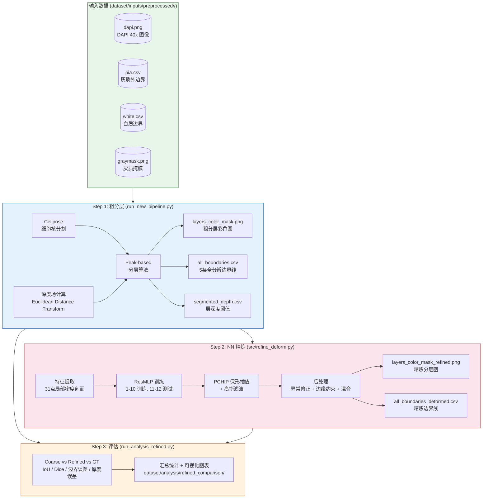
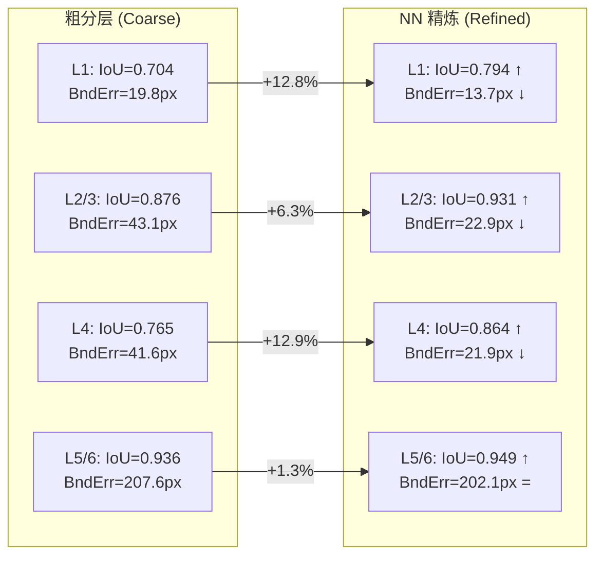

# AutoLaminarSegment — 自动皮层分层分割与精炼

## 管线总览



---

## Step 1: 粗分层

```powershell
.\venv-cellpose\Scripts\python run_new_pipeline.py
```

输入（每个样本 `dataset/inputs/preprocessed/<n>/`）：
| 文件 | 说明 |
|------|------|
| `dapi.png` | DAPI 染色图像 (40x) |
| `pia.csv` | 灰质外边界 (GM, 即 pia 表面) |
| `white.csv` | 白质边界 (WM) |
| `graymask.png` | 灰质二值掩膜 |

输出（`dataset/outputs/<n>/`）：
| 文件 | 说明 |
|------|------|
| `cell_centroids.csv` | Cellpose 分割的细胞中心点 |
| `segmented_depth.csv` | peak-based 分层深度阈值 |
| **`all_boundaries.csv`** | **5 条全分辨率边界线**（pia, L1_2, L3_4, L4_5, white） |
| `layers_color_mask.png` | 粗分层彩色图 |
| `layer_lines.png` | 边界线可视化 |

关键参数：
- `--samples 1 2 3` — 只处理指定样本
- `--no-gpu` — CPU 模式
- `--skip-cellpose` — 跳过细胞分割，复用已有 centroids

---

## Step 2: NN 边界精炼（液化微调）

```powershell
# 完整训练 + 推理
.\venv-cellpose\Scripts\python src/refine_deform.py --blend 0.4
```

用 ResMLP 网络学习从局部细胞密度模式到 GT 边界偏移的映射。

### 算法

1. **特征**：沿边界法线方向采样 **31 点密度剖面**（半径 250px, grid_step=50）
2. **模型**：ResMLP — 输入 36 维 → 128 → 64 → 32 → 1（Δy 偏移）
3. **训练**：样本 1-10 作为训练集，样本 11-12 作为测试集
4. **平滑**：PCHIP 保形插值 + 高斯后滤波 + 局部异常修正 + 边缘渐变约束

### 参数

| 参数 | 默认 | 说明 |
|------|------|------|
| `--blend` | 0.4 | 形变混合比例。1.0=全量精炼，0.4=适度，0.2=微调 |
| `--model` | resmlp | 模型架构（resmlp / mlp） |
| `--train` | 1-10 | 指定训练样本 |
| `--predict` | all | 指定推理样本 |

输出：
| 文件 | 说明 |
|------|------|
| **`all_boundaries_deformed.csv`** | **NN 精炼后的边界线**（与 all_boundaries.csv 格式一致） |
| `layers_color_mask_refined.png` | 精炼分层图（与粗分层对比） |
| `comparison_refined.png` | 三栏对比：Coarse vs Refined vs GT |
| `models/refine_deform/` | 训练好的模型权重 |

---

## Step 3: 结果评估

```powershell
# 粗分层评估
.\venv-cellpose\Scripts\python run_analysis.py

# 粗 vs 精炼对比评估（含 Nature 风格对比图）
.\venv-cellpose\Scripts\python run_analysis_refined.py
```

评估指标：IoU / Dice / Precision / Recall / 边界误差 / 厚度误差

输出：
- `dataset/analysis/<n>/analysis_comparison.csv` — 每样本粗/精逐层对比
- `dataset/analysis/refined_comparison/` — 汇总统计与可视化

---

## 效果展示 — 最佳案例 Sample 7



| 指标 | L1 | L2/3 | L4 | L5/6 |
|------|-----|------|----|------|
| **IoU 提升** | +12.8% | +6.3% | +12.9% | +1.3% |
| **边界误差降幅** | **−30.8%** | **−46.9%** | **−47.4%** | −2.6% |
| **厚度误差降幅** | −10.0pp | −2.3pp | −4.8pp | −1.6pp |

对比图见 `dataset/analysis/7/comparison_refined_vs_coarse.png`

---

## 综合对比汇总

| 指标 | Coarse | Refined (blend=0.4) | 改进 |
|------|--------|---------------------|------|
| **Overall IoU** | 0.763 | **0.793** | **+3.9%** |
| **Overall Dice** | 0.855 | **0.876** | **+2.5%** |
| **Overall 边界误差** | 64.9 px | **58.4 px** | **+10.1%** |
| **Overall 厚度误差** | 16.2% | **11.9%** | **−4.3pp** |

### 逐层边界误差

| 层 | Coarse | Refined | 改进 |
|----|--------|---------|------|
| **L1** | 28.8 px | **25.3 px** | +12.0% |
| **L2/3** | 53.7 px | **34.4 px** | **+35.9%** |
| **L4** | 62.0 px | **52.3 px** | +15.7% |
| L5/6 | 115.3 px | 121.5 px | −5.3% |

### 逐层 IoU

| 层 | Coarse | Refined | 改进 |
|----|--------|---------|------|
| L1 | 0.690 | **0.737** | +6.9% |
| L2/3 | 0.851 | **0.903** | +6.1% |
| L4 | 0.663 | **0.696** | +5.0% |
| OVERALL | 0.763 | **0.793** | +3.9% |

边界误差降低最显著的是 **L2/3 层（−35.9%）**，IoU 提升最显著的是 **L1 层（+6.9%）**。

---

## 数据目录结构

```
dataset/
├── inputs/
│   ├── preprocessed/<n>/    # 预处理输入
│   │   ├── dapi.png         # DAPI 图像
│   │   ├── pia.csv          # pia 边界
│   │   ├── white.csv        # white 边界
│   │   └── graymask.png     # 灰质掩膜
│   └── label/<n>/           # 人工标注 GT
│       ├── label_mask.png
│       └── label_boundaries.csv
├── outputs/<n>/             # 粗分层 + 精炼结果
│   ├── cell_centroids.csv
│   ├── segmented_depth.csv
│   ├── all_boundaries.csv
│   ├── all_boundaries_deformed.csv    ← NN 精炼
│   ├── layers_color_mask.png
│   └── layers_color_mask_refined.png  ← NN 精炼
└── analysis/                # 分析结果
    ├── <n>/                  # 每样本逐层指标
    │   ├── analysis_results.csv         # 粗分层评估
    │   ├── analysis_comparison.csv      # 粗/精对比
    │   └── comparison_refined_vs_coarse.png  # 对比图
    ├── summary/              # 粗分层汇总
    └── refined_comparison/   # 粗/精对比汇总
        ├── comparison_summary.csv
        └── figures/
            ├── coarse_vs_refined_bar.png
            └── improvement_heatmap.png
```

## 环境

使用 `venv-cellpose` 虚拟环境：
```powershell
.\venv-cellpose\Scripts\python <script.py>
```

依赖：PyTorch 2.4, OpenCV, scipy, cellpose, matplotlib, pandas
